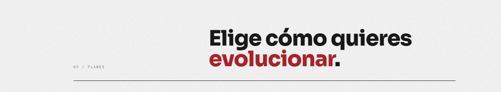
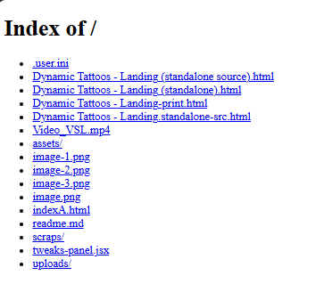

centrar texto

HABILITAR LAS SECCIONES DE ABAJO
falta su construcción, y sus datos pueden no ser reales

La que pone print imprime pa la impresora
La que pone indexA es la buena. Las otras son una copia más o menos optimizada.

